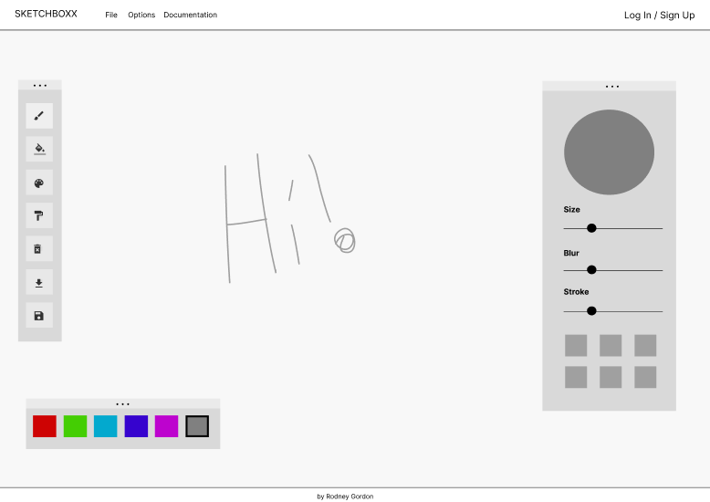
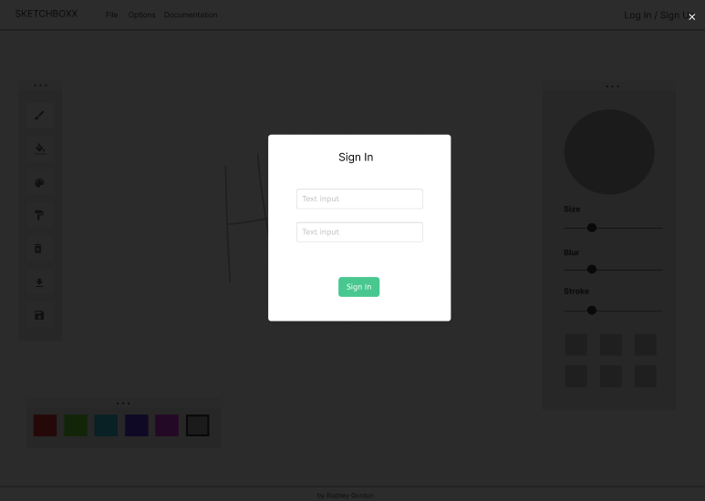

# Skectchboxx Project Overview

Sketchboxx is a web application that allows users to create artwork. The application is designed to be user-friendly and intuitive for users of all ages while giving access to a wide range of creative tools.

## Tech Stack
This is going to be built using a variety of technologies. The heavy lifting is coming from the P5 processing library. The backend will be built using Node.js and Express. The database will be managed using MySQL. The frontend will be built using html with Bulma for styling support. I'm going avoid brinng in any additional libraries for the frontend if I can help it.

- MySQL for database management (https://www.mysql.com/)
- Express for backend routing (https://expressjs.com/)
- Node.js for server-side scripting (https://nodejs.org/)
- P5 for drawing tools (https://p5js.org/)
- Bulma for styling (https://bulma.io/)

## Features
- Account registration and login
- Guest Flow
    - Access sketch creation tools (Drawing Feaures below)
    - Export to file
- Account Flow
    - Manage Account Settings (change password, etc.)
    - Saving files
    - Additional options for exporting and sharing files
    - Save Color Plettes
- Drawing Features
    - Layer and opacity controls
    - Art tools
        - paint brush
        - pencil paint
        - vector tool
        - eraser tool
- Nice to have features (stretch)
    - Autosave files
    - Mobile & Tablet support
    - Advances creation tools

## User Stories

#### Guest User
A guest user should have immeidate access to basic features such as creating and exporting artwork. This such as saving artwork and advanced features such as custom color palettes should not be available to a guest user.

#### Account User
An account user should have access to all the features of a guest user. In addition, they should be able to save their artwork, manage their account settings, and have access to features that require saving data such as custom color palettes that can be saved for future use.

## Wireframes
These are in progress I shared the figma link to view additional screens as they are added, still getting familar with Figma and whats possible for via P5 and Bulma.

[Figma](https://www.figma.com/design/jikcBzFjXsJbxSr9qHOpUp/Sketchboxx?node-id=1-4&t=QDKgMcoSflqMrL88-4)